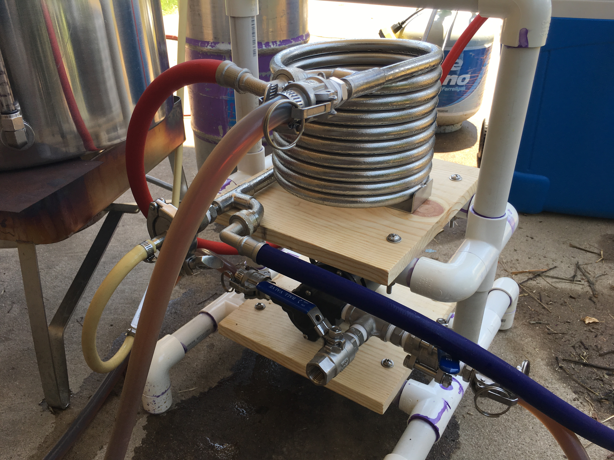
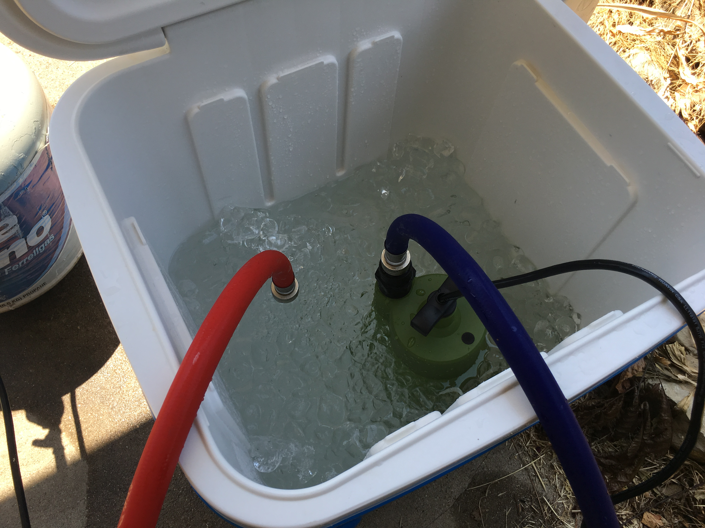
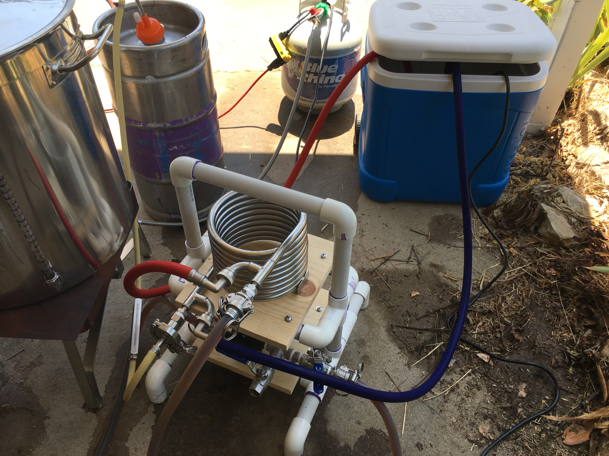

**Texas is hot.**

For some Texans, it's a matter of pride that we effectively forge our existence on the surface of the sun. For others, it's a reality that we'd rather avoid by spending our lives indoors, enjoying the gentle breeze of the air conditioner. However, most homebrewers realize that it's easier to brew outside (your spouse won't complain when you make a mess), as well as necessary for direct fire brewing systems (your spouse will commend you when you don't burn down the house).

**But again... Texas is hot.**

Sweaty brew days aside, this can create serious problems when attempting to chill wort to fermentation temps. Groundwater is consistently over  80 °F for much of the year. As a result, it's often impossible to knock out in the optimal temperature range for most yeast strains.

In the past, I utilized a "pre-chiller" by submerging an immersion chiller in an ice water bath and running groundwater through it on the way to the counterflow chiller. However, the pre-chiller only brought down knockout temps by 6-8 °F, which was insufficient in many cases. I didn't want to revisit this half measure.

## The System
I decided to set up a recirculating cold liquor system, similar to what I used as a professional brewer. This also gave me the opportunity to build a caddy for my pump and stainless counterflow chiller.

> You too can build a similar caddy in a matter of a few hours.

### Parts List
- 1/6 HP submersible pump from [Harbor Freight](https://www.harborfreight.com/16-hp-submersible-utility-pump-1600-gph-63319.html)
- 1/2" ID SS-braided washer hoses from [Home Depot](https://www.homedepot.com/p/Everbilt-4-ft-Universal-Stainless-Steel-Washing-Machine-Hose-with-Elbow-2-Pack-98257/307638977)
- Wood board (pine, oak, etc.)
- 1" PVC pipe and connectors
- Stainless steel screws, nuts, and washers

### Setup
I hooked up the pump to the counterflow chiller and placed it in an ice water bath. I used 30 lb of ice, though I probably could have gotten by with 20 lb. But there's no harm in using more if you can find a cheap source for ice.

> The pump in action.

#### The Process
- The pump pushes water through the blue hose
- The water passes through the counterflow chiller
- The water returns to the cooler through the red hose

Everything else in the system is typical of a counterflow chilling setup - the wort is pumped through the counterflow chiller and cools as the water warms. The ice will gradually be melted by the recirculating water, but provided that enough ice is used, the water will stay cold.

> PRO TIP 
> Stick your hands in the ice water. Or even your head. It doesn't help chill the wort, but it feels good and wards off heat stroke.

## Using the System
These are the details on how I integrated the recirculating cold liquor system into my brewing process.

### End of Boil
- Whirlpool for 15 minutes by pumping hot wort through the counterflow chiller and back into the kettle
  - This dropped the wort temp from boiling to ~190 °F
- Run groundwater through the counterflow chiller for 10 minutes while continuing to recirculate the wort
  - This dropped the wort temp to ~100 °F in 15 minutes
  - An added benefit of chilling while recirculating wort is the ability to leave the cold break in the kettle
- 15 minute rest
- Start the recirculating cold liquor system and begin knocking out into the fermenter
  - It only took 10 minutes to knock out 5.5 gallons of wort at 62 °F

---

Ultimately, I'm incredibly pleased with this new setup and plan to use it for most of my brews. I've read about other variants of this system, including dual counterflow chillers (1 for groundwater, 1 for cold liquor), immersion chilling (recirculating cold liquor through a chiller in the kettle), etc. I encourage you to experiment and find the best solution for your brewing system. 

Temperature control is often overlooked by homebrewers, but it's critical for yeast health and beer quality. Fortunately, we have many tools at our disposal, the most important of which is the creative, problem-solving mind.